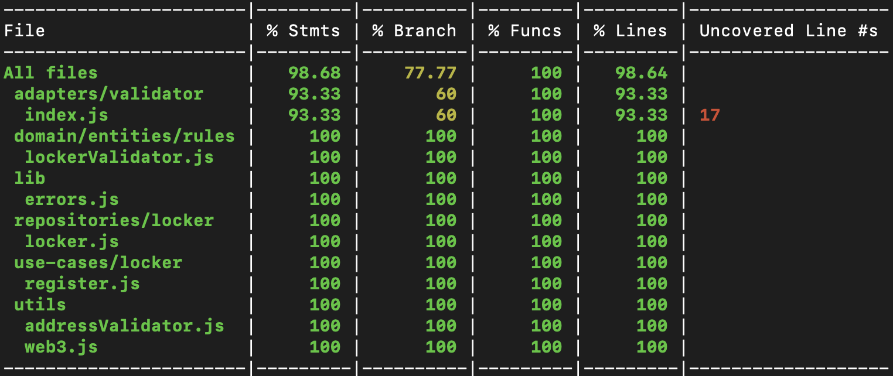

# locfac

locfac is a digital locker, accounts can register lockers with a specific identifier and can manage access to the locker.
The information about locker and access to it are maintained on a Smart Contract for Ethereum blockchain.

The functionality exposed by smart contract is abstracted with JavaScript repository, which is consumed by the use-cases.

## Environment Configuration
- ### npm install
- ### npm test - Runs test scripts, printing specifications and highlighting code coverage stats.
- ### npm run dev - Runs test Ethereum Environment

## Performing transactions on Ethereum Environment
sample.js demonstrates how transaction is performed using repository within a use-case to register a locker.

```bash
node sample.js
```

## Code Coverage - Until I get the badge working :P


## Directory Structure
- adapters
    - **validator** - Contains the implementation for the validator.
    - **contracts** - Contains Smart Contract Code in Ethereum.
    - **migrations** - Contains migration/deployment definition for Smart Contracts.
    - **domain** - Contains entities and business/validation rules defintions.
    - **lib** - Contains common libray code.
    - **repositories** - Contains repository abstraction over Smart Contracts.
    - **use-cases** - Contains use-cases.
    - **env** - Environment configurations.
